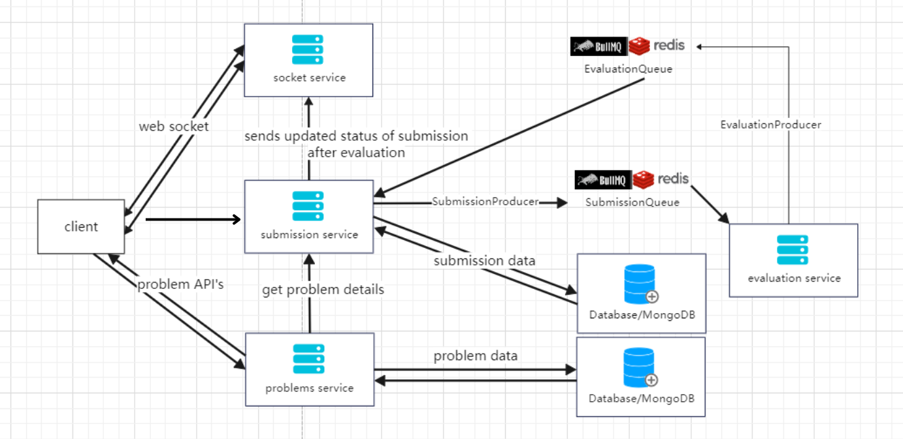

### Online Code Judge Backend

This repository implements the backend infrastructure for an online code judge platform. It utilizes Node.js microservices for modularity and scalability, enabling efficient code submission processing and evaluation.

#### Architecture Inspiration from LeetCode



1. User interacts with the frontend application (or socket client) to select a problem and submit their code solution.
2. Frontend sends the code with some other details (problem ID, user ID) to the Submission Service.
3. Client/Frontend can also interacts with Problems Service to do CRUD operations on problems.
4. Submission Service validates the request, verifies the problem ID with the Problems Service (to get details about the problem), and adds the submission to the BullMQ queue for processing.
5. Submission Service also add the submission details to DB with status as 'PROCESSING', indicating that submission is evaluationg.
6. Evaluation Service worker picks up submissions from the BullMQ queue.
7. Evaluation Service creates a Docker container with the appropriate language environment based on the submission and executes the submitted code within the container, running it against the problem's test cases.
8. Evaluation Service sends evaluation results (success, failure, etc) back to the Submission Service.
9. Submission Service update the submission in DB with updated status.
10. Submission Service sends response to Socket Server
11. Socket Server broadcasts the submission status update to connected clients via websocket.

#### Microservices

The project comprises several interconnected microservices, each responsible for a specific task:

1. Problems Service (Node.js, Express, MongoDB):

- Manages CRUD (Create, Read, Update, Delete) operations for problems.
- Provides a RESTful API for interacting with problem data.
- Integrates with other services for submission handling and evaluation.
- Key technologies: Express, Mongoose, dotenv, winston, winston-mongodb.

2. Submission Service (Node.js, Fastify, MongoDB):

- Handles code submissions, adding them to a queue for asynchronous processing.
- Offers a RESTful API for submitting code solutions.
- Utilizes BullMQ for queueing and Redis for queue management.
- Key technologies: Fastify, BullMQ, ioredis, dotenv, winston, winston-mongodb.

3. Evaluation Service (Node.js, Express, BullMQ, Docker, TypeScript):

- Evaluates submitted code in various programming languages using Docker containers.
- Delivers a RESTful API for code evaluation.
- Utilizes BullMQ for job queues, Docker for containerized execution, Zod for schema validation, and TypeScript for type safety.
- Key technologies: Express, BullMQ, Dockerode, ioredis, Zod, TypeScript.

4. Socket Server (Node.js, Socket.IO):

- Establishes real-time communication channels between clients and the submission service.
- Enables clients to track submission progress or receive updates.
- Leverages Redis as a cache to store and retrieve user requests efficiently.
- Key technologies: Socket.IO, Redis.

5. Socket Client (JavaScript): (Frontend development beyond this repo)

- Handles communication with the socket server from the user's browser.
- Updates the user interface based on real-time updates received from the server.
- Key technologies: Web browser APIs, Socket.IO (client-side library).

#### Getting Started

Prerequisites:

```bash
Node.js
MongoDB database
Redis server
Docker
```

#### Further Development:

Implement a user authentication system for account management and submission tracking.
Develop a frontend application using a web framework like React or Vue.js to provide a user-friendly interface.
Explore integrating with a cloud-based database or container orchestration platform (e.g., Kubernetes) for enhanced scalability and deployment.
